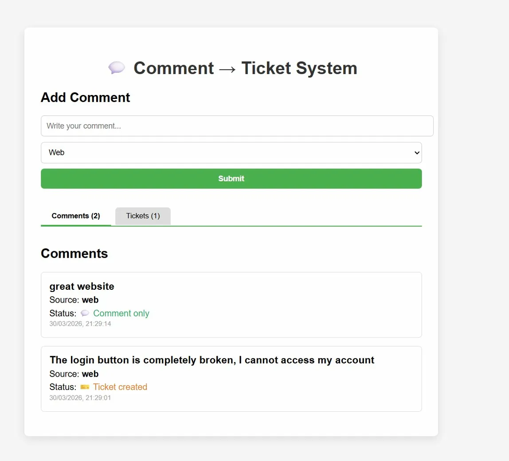
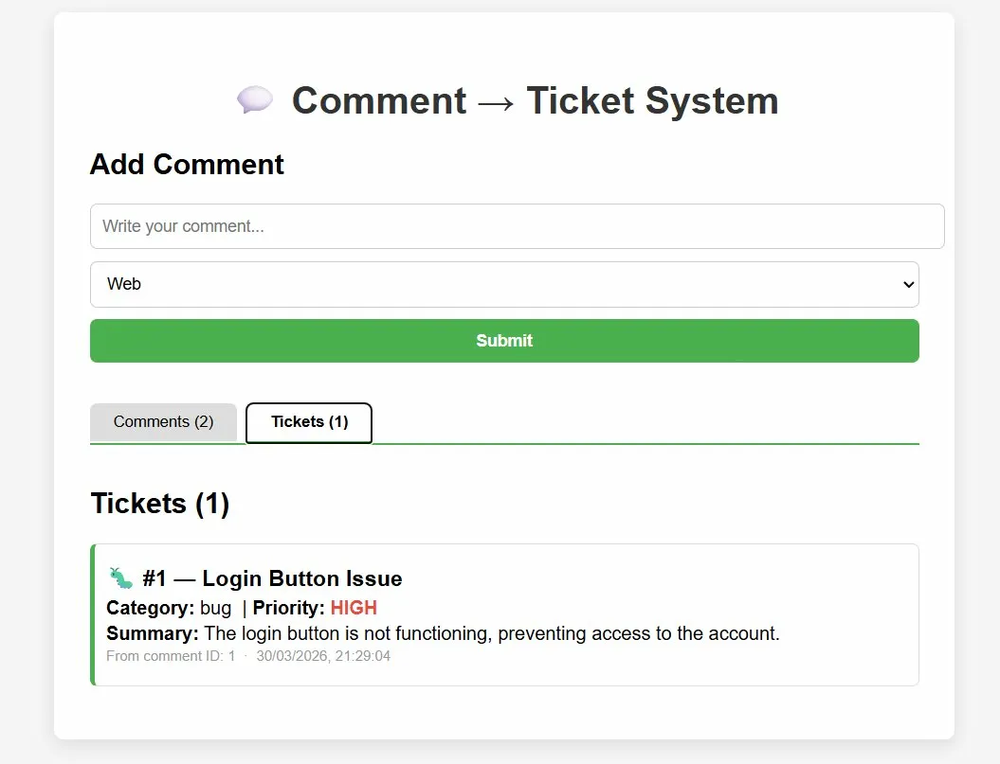

# PulseDesk — Comment-to-Ticket Triage

An AI-powered support ticket generator built for IBM's internship technical challenge.
PulseDesk collects user comments and automatically determines whether they should become
support tickets using the Hugging Face Inference API.

## How It Works

1. A user submits a comment via the API or UI
2. The comment is analyzed by **Meta Llama 3.1 8B** via Hugging Face's Inference Router
3. If the comment describes a bug, complaint, or request, a structured ticket is generated
4. The ticket is stored with a title, category, priority, and summary

## Tech Stack

- **Backend**: Java 21, Spring Boot 3.3.5, Spring Data JPA
- **Database**: H2 (in-memory)
- **AI**: Hugging Face Inference API — `meta-llama/llama-3.1-8b-instruct`
- **Frontend**: React 18, Vite 5
- **Deployment**: Railway

## Live Demo

- Frontend: https://practical-achievement-production.up.railway.app
- Backend API: https://comment-to-ticket-triage-production.up.railway.app

## API Endpoints

| Method | Endpoint | Description |
|--------|----------|-------------|
| POST | `/comments` | Submit a comment for analysis |
| GET | `/comments` | View all submitted comments |
| GET | `/tickets` | View all generated tickets |
| GET | `/tickets/{id}` | View a single ticket by ID |

### Example Request
```bash
curl -X POST https://comment-to-ticket-triage-production.up.railway.app/comments \
  -H "Content-Type: application/json" \
  -d '{"text": "The app crashes every time I try to login", "source": "web"}'
```

### Example Response
```json
{
  "id": 1,
  "text": "The app crashes every time I try to login",
  "source": "web",
  "createdAt": "2026-03-30T18:49:55",
  "convertedToTicket": true
}
```

## Local Setup

### Prerequisites
- Java 21
- Maven

### Steps

1. Clone the repository:
```bash
git clone https://github.com/KamGytis/Comment-to-Ticket-Triage.git
cd Comment-to-Ticket-Triage
```

2. Set your Hugging Face API token as an environment variable:
```bash
# Windows PowerShell
$env:HF_TOKEN = "hf_your_token_here"

# Mac/Linux
export HF_TOKEN=hf_your_token_here
```

3. Run the backend:
```bash
./mvnw spring-boot:run
```

4. Run the frontend:
```bash
cd frontend
npm install
npm run dev
```

5. Open http://localhost:5173 in your browser

## Screenshots

### Comments View


### Tickets View



## Deployed on Railway

Both services are deployed separately on Railway.

### Backend Deployment

1. Go to [railway.app](https://railway.app) and create a new project
2. Click **"Deploy from GitHub repo"** and select your repository
3. Set the following environment variables in the **Variables** tab:
   - `HF_TOKEN` = your Hugging Face API token
   - `PORT` = `8080`
4. Go to **Settings → Networking** and set the port to `8080`
5. Railway will automatically build and deploy using the `Dockerfile`

### Frontend Deployment

1. In the same Railway project, click **"New Service" → "GitHub Repo"**
2. Select the same repository
3. Go to **Settings → Build** and set **Dockerfile Path** to `/Dockerfile.frontend`
4. Set the following environment variables in the **Variables** tab:
   - `VITE_API_URL` = your backend Railway URL (e.g. `https://your-backend.up.railway.app`)
   - `PORT` = `80`
5. Go to **Settings → Networking** and set the port to `80`
6. Railway will build and deploy the frontend

### Environment Variables Summary

| Service | Variable | Value |
|---------|----------|-------|
| Backend | `HF_TOKEN` | Your Hugging Face token |
| Backend | `PORT` | `8080` |
| Frontend | `VITE_API_URL` | Your backend Railway URL |
| Frontend | `PORT` | `80` |

## Notes on AI Model

The originally suggested models (`mistralai/Mistral-7B-Instruct`, `google/flan-t5-base`)
returned `410 Gone` on the free Hugging Face Inference API tier as of March 2026.
This project uses `meta-llama/llama-3.1-8b-instruct` via Hugging Face's new
Inference Router (`router.huggingface.co`), which is still a Hugging Face model
and API as specified in the requirements.